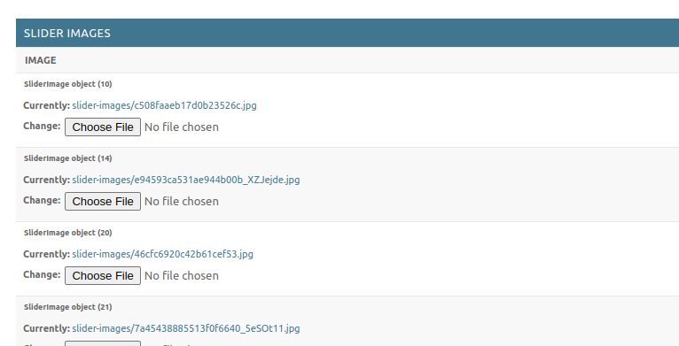

# Tổng quan trang web TIỆM CỦA GIÓ

## 1. Tài khoản đăng nhập
Trang web bán bánh

**Website:** https://namvuong.org/

**Admin panel:** https://namvuong.org/django/admin_panel/

**username:** tiemcuagio_admin

**password:** cachmangthang8
## 2. Mục tiêu
- Thêm vào giỏ hàng
- Thanh toán trực tuyến, thanh toán dư sẽ lưu vào số dư trong tài khoản
- Người dùng có thể yêu cầu rút tiền dư trong tài khoản 
- Xem trạng thái đơn hàng, hủy đơn
- Nhận thông báo khi lên cấp và trạng thái đơn hàng thay đổi
- 
- Người dùng có cấp độ khác nhau
- Sửa thông tin
- Bình luận, trả lời bình luận
- 
- Trang admin chỉnh sửa nội dung trang web
- Thêm sản phẩm, viết bài, duyệt đơn

## 3. Tổ chức files
### website-design directory
Viết chi tiết thiết kế backend. Database-schema là trái tim của dự án vẽ lại toàn bộ cơ sở dữ liệu và liên kết.
Thư mục diagrams chứa cách flowchart của các chức năng như thanh toán, bình luận. order-states-flowchart là một file rất quan trọng bao gồm 7 hướng đi một đơn hàng có thể trải qua, màu đỏ tô nơi thay đổi trạng thái.

File api_documentation.odt ghi toàn bộ api links

restrictions.txt ghi hạn chế, updates ghi nâng cấp sau này

customer_requests.odt bao gồm toàn bộ yêu cầu của khách hàng

### web-servers directory
Các files dùng cho webserver django --> gunicorn --> socket --> nginx. 
Các file này trở thành symbolic links liên kết trong thư mục /etc/nginx/sites-enables và /etc/systemd/system/.
Khi server khởi động lại gunicorn, nginx tự động được bật lên

có file bash resize.sh để giảm kích thước ảnh giúp website mượt mà hơn.

### tiemcuagio_django  directory
Chứa phần backend của website

### tiemcuagio-react directory
Chứa phần font-end của website

## 4. Minh họa website
### User
Càng lên cấp trang web càng được trang trí nhiều hơn

Xem trạng thái đơn hàng

---
### Admin 
Viết bài cho sản phẩm 

Cập nhật trạng thái đơn hàng

Chỉnh sửa hình slider ở home page

